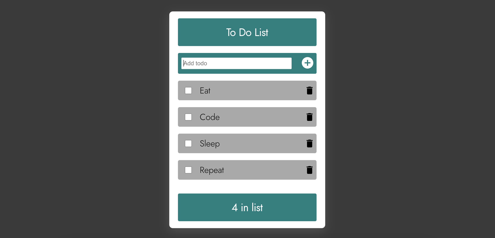

# To-Do List Application

- This is a simple to-do list application that helps you organize your tasks and stay productive.

# Application image

# Features

- The to-do list application has the following features:

- Add new to-do items
- Mark to-do items as complete
- Delete to-do items

# Usage

- To use the to-do list application, simply follow these steps:

- Enter a new to-do item in the text box at the top of the page.
- Click the "Add" button to add the to-do item to the list.
- To mark a to-do item as complete, click the checkbox next to the item.
- To delete a to-do item, click the "X" button next to the item.

# Additional information

- The to-do list application uses the following dependencies:

- React
- ReactDOM
